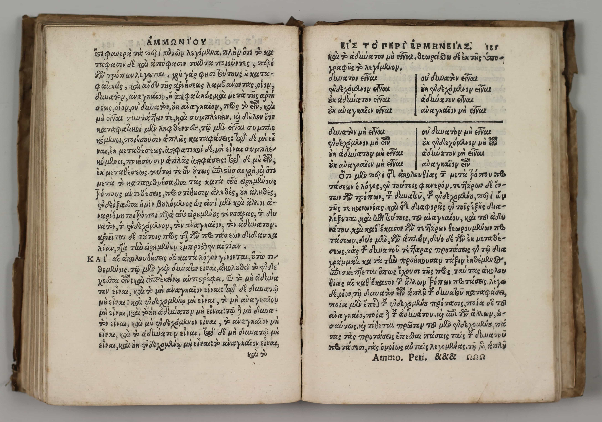

cf. [Wiktionary](https://en.wiktionary.org/wiki/%E1%BD%91%CF%80%CF%8C%CE%BC%CE%BD%CE%B7%CE%BC%CE%B1):

> ### Etymology
> 
> From ὑπομιμνήσκω (hupomimnḗskō) +‎ -μα (-ma).
> 
> ### Pronunciation
> * IPA(key): /hy.póm.nɛː.ma/ → /yˈpom.ni.ma/ → /iˈpom.ni.ma/
> 
> ### Noun
> 
> ῠ̔πόμνημᾰ • (hupómnēma) n (genitive ῠ̔πομνήμᾰτος); third declension
> 
> 1. remembrance, memorial, record
> 2. a reminder, mention, notice
>     1. memorandum, note
>     2. (in the plural) minutes of the proceedings of a public body, public records
>     3. explanatory notes, commentary
>     4. a tablet used for keeping notes, analogous to a commonplace book
> 3. draft, copy of a letter

