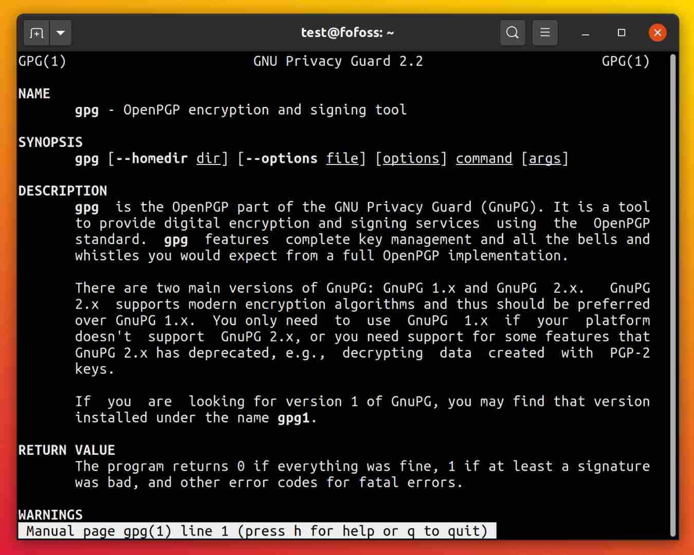
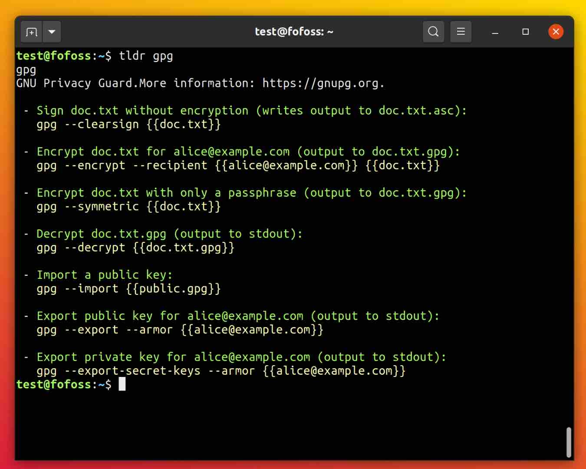
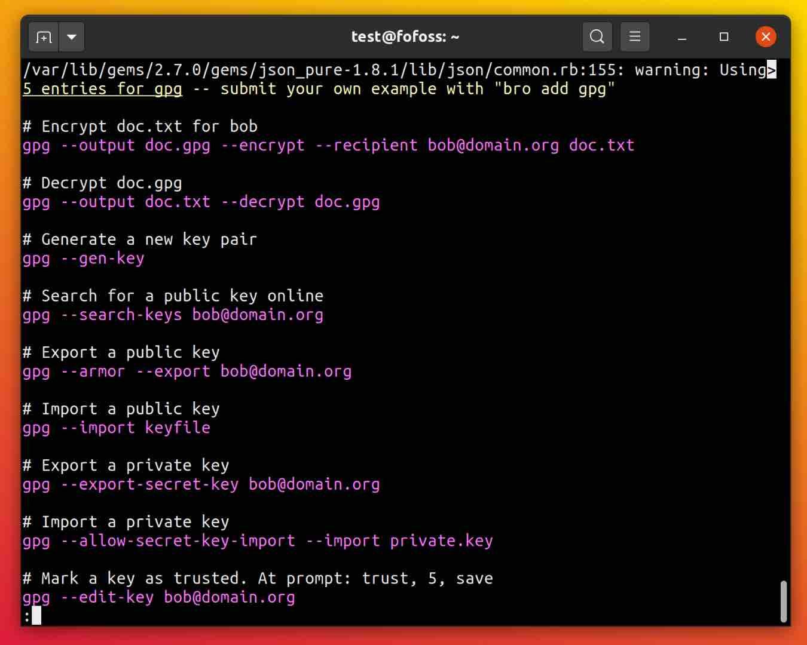
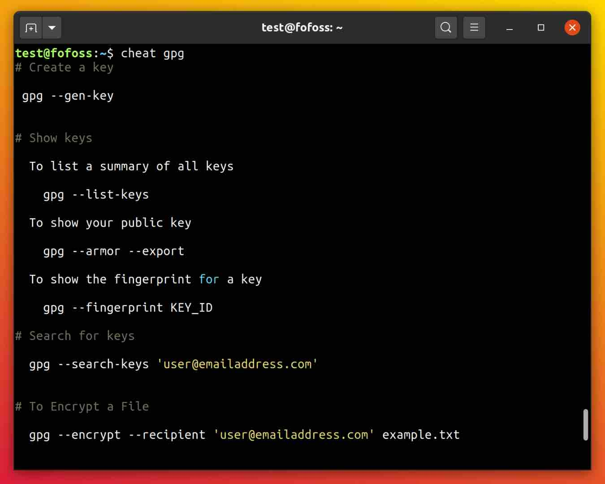
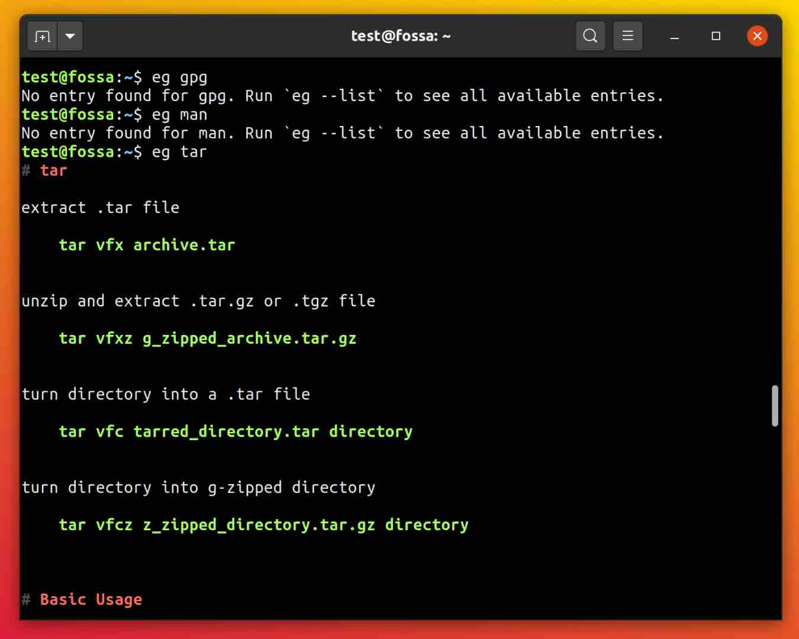

---
title: One small step for man
date: 2020-04-08
...

'Read the manual'---timeless and sage advice. But what about a summary?  Can
one hundred words be more useful than twenty thousand? Enough developers think
so to write several alternatives to the classic Unix `man` and GNU `info`
systems. A quick test lookup of documentation for `gpg` brought surprising
results:

| command                                             | language | birth year | time (ms) | words |
| --------------------------------------------------- | -------- | -----------| ----------| ----- |
| [man](https://www.unix.com/man-page-repository.php) | C        | 1971       | 81.53     | 21884 |
| [info](https://www.gnu.org/s/texinfo)               | C, Perl  | 1986       | 70.86     | 57676 |
| [tldr](https://tldr.sh)                             | Multiple | 2013       | 8.31      | 103   |
| [bro](http://bropages.org)                          | Ruby     | 2014       | 351.17    | 308   |
| [cheat](https://github.com/cheat/cheat)             | Go       | 2014       | 99.92     | 525   |
| [eg](https://github.com/srsudar/eg)                 | Python   | 2015       | 103.64    | 357   |
| [cheat.sh](https://cheat.sh)                        | Python   | 2017       | 141.84    | 91    |

So this was a blowout, with `tldr` running away with performance.  Even though
the 'official' client is written in JavaScript, there are Ruby, Haskell, Perl,
Python, C++, Rust, Bash, and Go clients available. I had no idea that my
package manager had installed the C++ client by default. There's also a web
application, Dash integration, and an iOS app available. The silver medal goes
to the `cheat.sh` service which requires only internet access: a very
interesting approach that will no doubt be useful wherever applications cannot
be installed. `bro` kept throwing weird warnings and `eg` did not have `gpg` in
it's knowledge base, so I would not recommend them.  `cheat` offers users an
easy way to add their own content in custom 'cheat-sheets', with the 'community'
cheat-sheet being little more than a default source. Honestly, I never really
use `info` pages. Interestingly, colorless and ancient `man` still has the best
formatting of them all:

