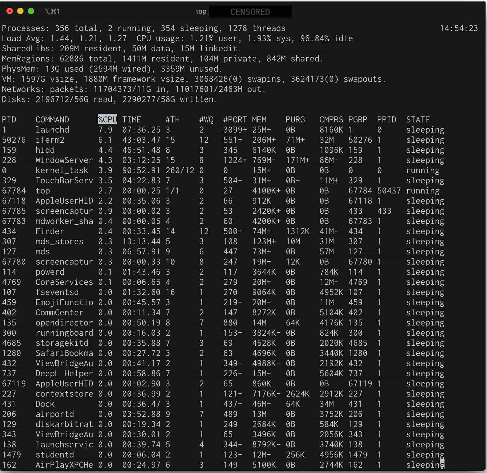
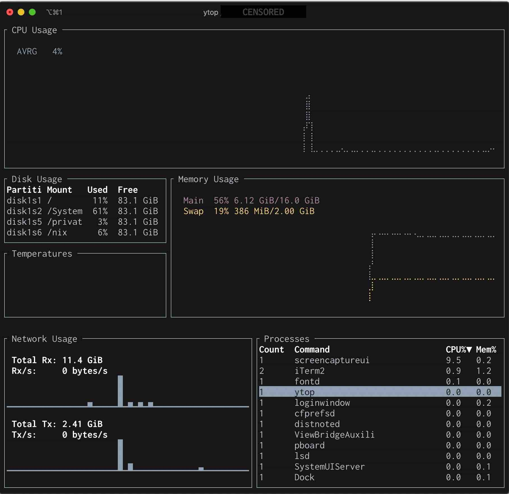
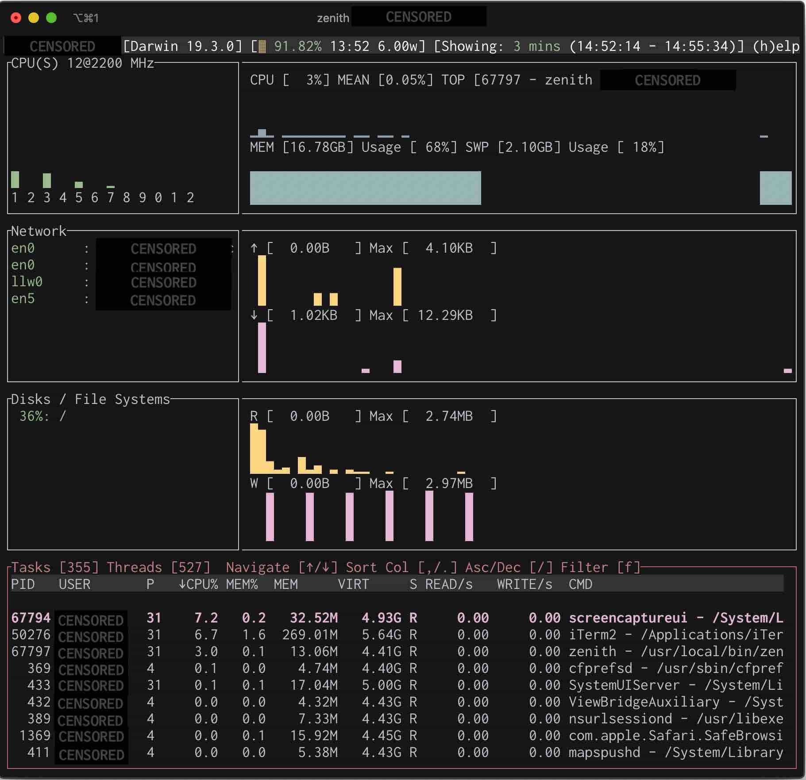
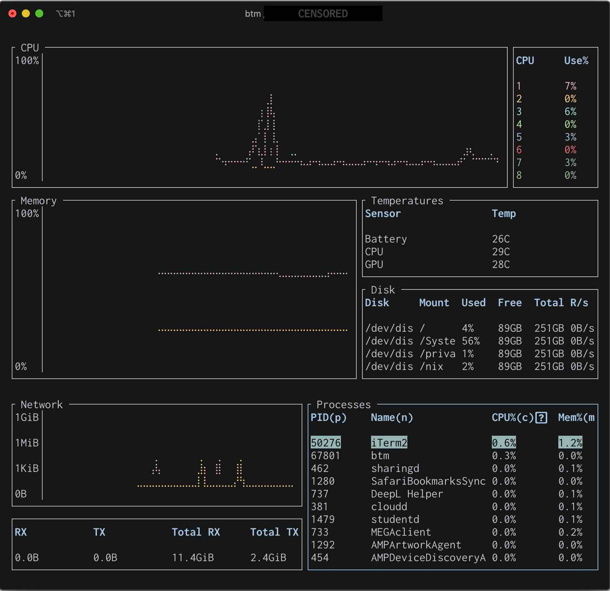
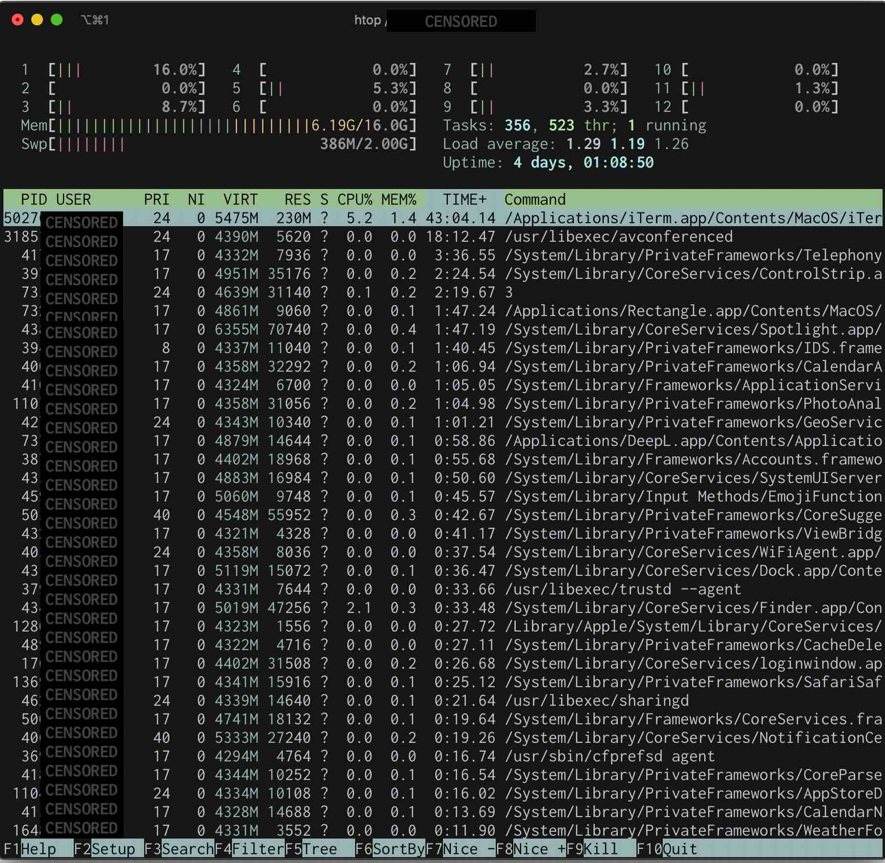
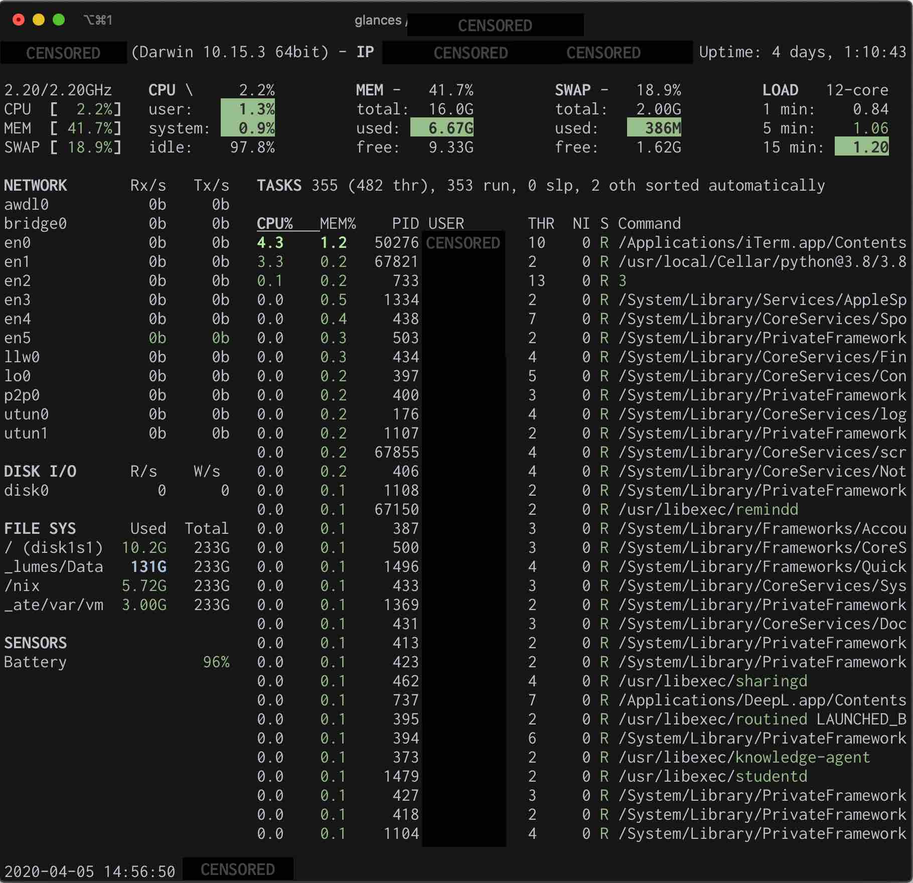
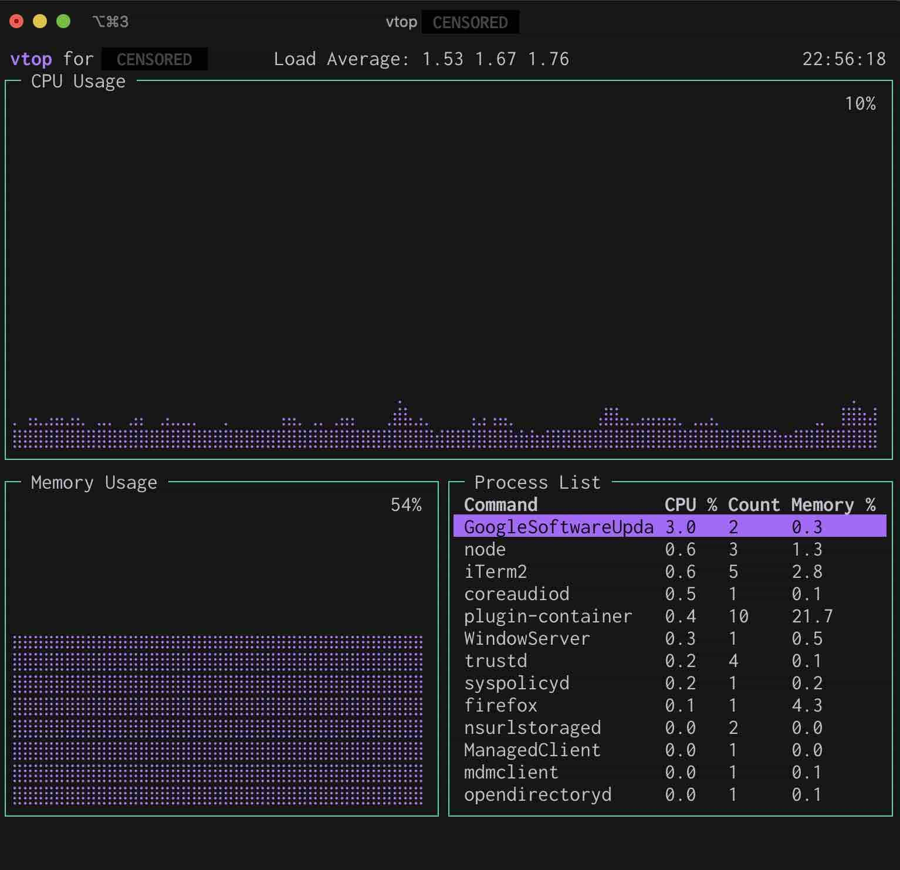

---
title: Spinning tops
date: 2020-04-05
...

System monitoring is useful whether on a home desktop, workstation, or server.
The classic Unix program `top` defines the standard interface: an interactive,
filterable, running tally of what is hogging how many resources. But in the
decades since release, `top` faces increasing competition:

| command                                          | year | language   |
|--------------------------------------------------|------|------------|
| [top](https://sourceforge.net/projects/unixtop/) | 1984 | C          |
| [htop](https://hisham.hm/htop/)                  | 2004 | C          |
| [glances](https://nicolargo.github.io/glances/)  | 2011 | Python     |
| [vtop](https://github.com/MrRio/vtop)            | 2014 | JavaScript |
| [gtop](https://github.com/aksakalli/gtop)        | 2017 | JavaScript |
| [btm](https://github.com/ClementTsang/bottom)    | 2019 | Rust       |
| [zenith](https://github.com/bvaisvil/zenith)     | 2019 | Rust       |
| [ytop](https://github.com/cjbassi/ytop)          | 2020 | Rust       |

What do these competitors offer? Mostly a better interface. For a long time
`htop` ruled the roost, but doesn't necessarily play well with terminal colors.
The way `htop` graphs its data is also... rudimentary. But it's well-known and
supported, so I used it [until
recently](https://www.wezm.net/v2/posts/2020/rust-top-alternatives/) I
discovered that Rust developers had been working on replacements. To decide
which of these alternatives is truly worthy, I decided to test them all by the
following criteria:

* how much memory and processing do they consume at idle?
* how 'fast' do they feel?
* how well do they handle different terminal sizes?
* do they include graphs and colors?
* how much do I like them?

First we can look at the more 'objective' stats. I include the minimum and
maximum percent observed while running the tests on an i7 (six-core, 2.2GHz)
laptop with 16GB of RAM. Some programs usage spiked, others remained steady.
Hopefully reporting the numbers this way gives a sense of that.  Measurements
were taken from `htop` and results are ranked from best to worst performance:

| command | min. CPU % | max. CPU % | min. MEM % | max. MEM % |
|---------|------------|------------|------------|------------|
| top     | 0.0        | 0.0        | 0.0        | 0.0        |
| htop    | 0.1        | 0.2        | 0.0        | 0.0        |
| ytop    | 0.2        | 0.9        | 0.0        | 0.0        |
| zenith  | 0.0        | 1.9        | 0.1        | 0.1        |
| btm     | 1.9        | 4.2        | 0.1        | 0.1        |
| glances | 0.0        | 7.7        | 0.3        | 0.4        |
| vtop    | 3.0        | 6.1        | 0.5        | 0.5        |
| gtop    | 3.1        | 7.2        | 0.6        | 0.6        |

In defense of `glances`, it does do more work than the others---including
reporting to a web interface and other potentially useful server-oriented
features. As for the others, the numbers speak for themselves. Let's consider
more subjective qualities: ranking from 0-3 where 0 means that a feature either
is not supported or is unacceptably bad. Results are sorted by total:

| command | color | scales | graphs | speed | info | like | total |
|---------|-------|--------|--------|-------|------|------|-------|
| ytop    | 2     | 2      | 3      | 3     | 2    | 3    | 15    |
| zenith  | 2     | 2      | 2      | 2     | 3    | 3    | 14    |
| btm     | 3     | 1      | 3      | 1     | 2    | 2    | 12    |
| htop    | 1     | 2      | 1      | 3     | 3    | 1    | 11    |
| top     | 0     | 3      | 0      | 3     | 3    | 1    | 10    |
| gtop    | 3     | 1      | 3      | 0     | 2    | 0    | 9     |
| glances | 2     | 1      | 0      | 0     | 3    | 0    | 6     |
| vtop    | 1     | 2      | 2      | 0     | 1    | 0    | 6     |

We see here that the JavaScript tools fall behind in both performance and in
functionality. The 'like' factor is of course very personal: if you don't
resize your windows much, the 'scales' column will probably impact your 'like'
factor far less than it does mine.  `ytop` and `btm` have `vi`-style controls
which I like, and `zenith` lets you move back and forth in time.  Below
are screenshots of the tools ranked by how likely I am to use them, but none of
the new Rust tools are bad choices. `top` isn't going anywhere just yet.

